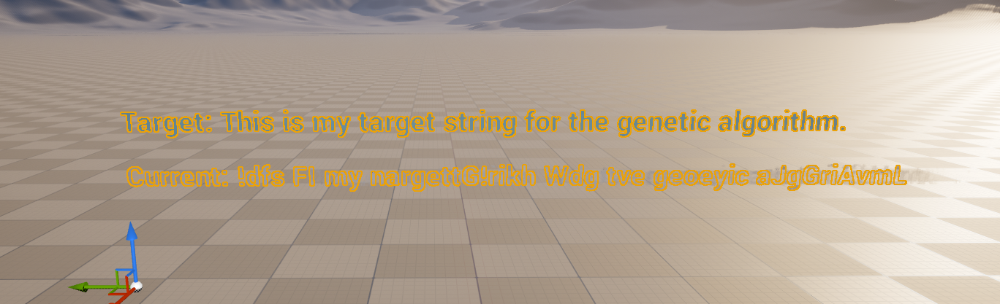

# EvoCompPlugin

Unreal Engine 5 C++ plugin with Evolutionary Computation algorithms.

## Overview

This plugin includes:

- A shared evolutionary base actor: `AEvoCompAlgorithmActor`
- A runtime GA actor class: `AEvoCompGeneticAlgorithm`
- A runtime image-evolution actor class: `AEvoCompImageEvolutionAlgorithm`
- A plugin-level Blueprint utility node: `Execute Genetic Algorithm`
- An editor menu shortcut:
  - `Window -> Genetic Algorithm -> Open Genetic Algorithm Main Blueprint`
  - `Window -> Genetic Algorithm -> Open Image Evolution Main Blueprint`

## Adding a new algorithm

1. Create a new C++ actor derived from `AEvoCompAlgorithmActor`.
2. Put algorithm-specific settings, results, and action methods on that actor.
3. Add a matching Details customization class for that actor.
4. Register the new actor in the editor module so its Details panel actions appear.
5. Create a Blueprint derived from the new actor and name it `BP_XXX_Main`.
6. Save that Blueprint in `/EvoCompPlugin` and add an editor menu entry for it if you want one-click access.

## Algorithms

Genetic Algorithm (GA)

#### Genetic Algorithm Implementation

##### Purpose

Evolve a random candidate string toward a fixed target sentence while showing the target and current best candidate directly in the editor viewport.

Target string used by default:

`This is my target string for the genetic algorithm.`

##### Display Behavior

- The actor auto-creates two text render components in the Blueprint/placed instance.
- The top line shows the target sentence.
- The lower line shows the current best candidate string.
- Pressing the main `Run` action starts the string evolution and updates the current line over time.
- When the best candidate improves, the editor log prints both the current string and the target string.

##### String Representation

- Population: a set of candidate strings with the same length as the target.
- Alphabet: letters, spaces, and a few common punctuation marks used by the target sentence.
- Candidate strings are generated randomly at the start of a run.

##### Fitness

Fitness combines exact character matches and character closeness:

$$
f(s) = 0.80 \cdot \text{ExactMatchRatio} + 0.20 \cdot \text{ClosenessScore}
$$

Exact matches dominate selection pressure, while the closeness term helps the search move toward the right letters faster.

##### Selection

Tournament selection of size 2 is used:

$$
s_p =
\begin{cases}
s_a, & f(s_a) \ge f(s_b) \\
s_b, & f(s_b) > f(s_a)
\end{cases}
$$

##### Crossover

With probability $p_c$, two parents combine with a single split point:

$$
s_c = s_A[0:k] + s_B[k:]
$$

Otherwise, the child is copied from the first parent.

##### Mutation

With probability $p_m$, non-matching characters may be randomized. Already-correct characters are preserved so progress is not immediately lost after a match is found.

##### Run Flow

1. Reset the actor state.
2. Create a random string population.
3. On each tick, step the string GA one or more generations.
4. Update the current on-screen string and print progress when the best match count improves.
5. Stop when the target is solved or the generation limit is reached.

##### Current Defaults

| Parameter | Value |
| --- | --- |
| TargetString | This is my target string for the genetic algorithm. |
| PopulationSize | 20 |
| MaxGenerations | 500 |
| MutationRate | 0.08 |
| CrossoverRate | 0.80 |
| FitnessThreshold | 0.965 |
| MinGenerationsBeforeStop | 30 |
| RequiredStableGenerations | 8 |
| bEnableElitism | true |
| StringGenerationsPerTick | 1 |

Image Evolution (Random-to-Target Patch Genome)

#### Purpose

Evolve a population of grayscale patch genomes toward a target image by minimizing patchwise grayscale error.
The actor renders both target and evolving outputs on two plane meshes in-world.

#### Genome and Phenotype

- Genome length: `PatchColumns * PatchRows`
- Gene domain: `g_i in [0,1]` (grayscale)
- Phenotype: each gene controls one patch intensity in the synthesized image.

#### Fitness

Given target patch grayscale values `t_i` and candidate genes `g_i`:

$$
  \text{MAE}(g,t)=\frac{1}{N}\sum_{i=1}^{N}|g_i-t_i|,\qquad
f(g)=1-\text{MAE}(g,t)
$$

So `f in [0,1]`, higher is better.

#### Generation Update (Literature-aligned Evolution Loop)

1) Evaluate all individuals.
2) Rank by descending fitness.
3) Build next generation with elitism and rank-biased recombination.
4) Inject genes from the next-highest fitness individual with uniform crossover probability.
5) Apply mutation (reset or additive perturbation).

Core requested operator:

- Let `g^(1)` be best individual and `g^(2)` be second-best.
- Child starts from `g^(1)`.
- For each gene `i`, with probability `SecondBestGeneBorrowRate`, set child gene from `g^(2)_i`.

#### Realtime Animation

- Enable `bRealtimeEvolution`.
- Each actor tick executes `GenerationsPerTick` generation steps.
- During updates, the evolving preview texture is rebuilt from the current best genome and rebound to the evolving plane material.
- If world tick is not driving the actor (common in editor-only contexts), a fallback ticker continues realtime stepping.

#### Blueprint / Viewport Usage

- Run actions from a placed actor instance in a level.
- Calling action buttons from Blueprint class defaults can execute on the CDO (`Default__...`, `World=None`), which is not a live world instance.
- Current implementation forwards template calls to a real instance when one is found; if none exists, it logs a warning and does not run evolution on the CDO.

#### Source-Control Image Placement

- Import runtime target images into: `/EvoCompPlugin/Targets`
- Optional archival of raw original files: `Resources/ReferenceImages`

Suggested setup for a 512x512 target image:

- Import image into plugin content (for example: `/EvoCompPlugin/Targets`) as a `Texture2D`.
- Assign it to `TargetTexture` in your image-evolution Blueprint instance.
- Start with:
  - `PatchColumns=32`, `PatchRows=32`
  - `PopulationSize=64`
  - `MutationRate=0.03`
  - `MutationResetChance=0.20`
  - `MutationStepSize=0.08`
  - `SecondBestGeneBorrowRate=0.25`
  - `TopRankParentPoolSize=6`
  - `bEnableElitism=true`
  - `PreviewResolution=512`

