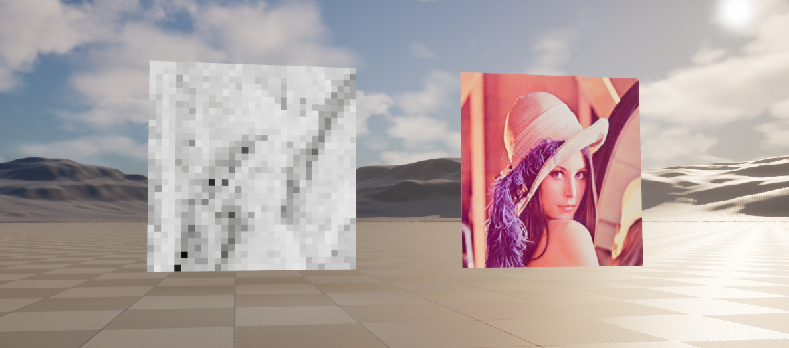

# EvoCompPlugin

Unreal Engine 5 C++ plugin with Evolutionary Computation algorithms.

## Overview

This plugin includes:

- A shared evolutionary base actor: `AEvoCompAlgorithmActor`
- A runtime GA actor class: `AEvoCompGeneticAlgorithm`
- A runtime image-evolution actor class: `AEvoCompImageEvolutionAlgorithm`
- A plugin-level Blueprint utility node: `Execute Genetic Algorithm`
- An editor menu shortcut:
  - `Window -> Genetic Algorithm -> Open Genetic Algorithm Main Blueprint`
  - `Window -> Genetic Algorithm -> Open Image Evolution Main Blueprint`

## Adding a new algorithm

1. Create a new C++ actor derived from `AEvoCompAlgorithmActor`.
2. Put algorithm-specific settings, results, and action methods on that actor.
3. Add a matching Details customization class for that actor.
4. Register the new actor in the editor module so its Details panel actions appear.
5. Create a Blueprint derived from the new actor and name it `BP_XXX_Main`.
6. Save that Blueprint in `/EvoCompPlugin` and add an editor menu entry for it if you want one-click access.

## Algorithms

Genetic Algorithm (GA)

#### Genetic Algorithm Implementation

- Search space: $x \in [0,1]$, population $P_t = \{x_1^{(t)},\dots,x_N^{(t)}\}$.

- Fitness:

  $$
  \Delta = x - 0.78, \qquad
  P(x) = e^{-32\Delta^2}, \qquad
  R(x) = \frac{1 + \cos(22\Delta)}{2}
  $$

  $$
  f(x) = \min\left(1,\max\left(0,\,P(x)\left(0.78 + 0.22R(x)\right)\right)\right)
  $$

- Selection (tournament size 2): sample $a,b$ uniformly and pick

  $$
  x_p =
  \begin{cases}
  x_a, & f(x_a) \ge f(x_b) \\
  x_b, & f(x_b) > f(x_a)
  \end{cases}
  $$

- Crossover (probability $p_c$):

  $$
  \alpha \sim U(0.2,0.8), \qquad x_c = \alpha x_A + (1-\alpha)x_B
  $$

  Otherwise, $x_c = x_A$.

- Mutation (probability $p_m$):

  $$
  x_c \leftarrow x_c + \epsilon, \qquad
  \epsilon \sim U(-0.1,0.1), \qquad
  x_c \leftarrow \min(1,\max(0,x_c))
  $$

- Elitism: if enabled, copy best of $P_t$ directly into $P_{t+1}$.

- Running best:

  $$
  F_t = \max\left(F_{t-1},\max_{x\in P_t} f(x)\right)
  $$

- Stability counter with threshold $\tau$:

  $$
  s_t =
  \begin{cases}
  s_{t-1}+1, & F_t \ge \tau \\
  0, & F_t < \tau
  \end{cases}
  $$

- Early stop when both hold: $t \ge G_{\min}$ and $s_t \ge S_{\min}$; otherwise continue to MaxGenerations.

Current defaults:

| Parameter | Value |
| --- | --- |
| PopulationSize | 20 |
| MaxGenerations | 500 |
| MutationRate | 0.08 |
| CrossoverRate | 0.80 |
| FitnessThreshold | 0.965 |
| MinGenerationsBeforeStop | 30 |
| RequiredStableGenerations | 8 |
| bEnableElitism | true |

#### String Target Test (Default: HELLO)

The same GA actor now includes a simple string-search test:

- `TargetString` (editable, default `HELLO`)
- `Run String Target Test` button in `GA | Actions`
- `BestCandidateString` output in `GA | String Test | Results`

How it works:

- Each candidate is a fixed-length string with the same length as `TargetString`.
- Selection uses tournament selection.
- Crossover uses one-point splice.
- Mutation changes random characters based on `MutationRate`.
- Fitness rewards exact character matches, with a small character-distance bonus.
- The run stops when exact match is found or early-stop criteria are satisfied.

Recommended starting values for quick convergence:

- PopulationSize: 120
- MaxGenerations: 400
- MutationRate: 0.06
- CrossoverRate: 0.80
- FitnessThreshold: 1.0
- MinGenerationsBeforeStop: 10
- RequiredStableGenerations: 3
- bEnableElitism: true
- bUseDeterministicSeed: true
- RandomSeed: 1337

Image Evolution (Random-to-Target Patch Genome)

#### Purpose

Evolve a population of grayscale patch genomes toward a target image by minimizing patchwise grayscale error.
The actor renders both target and evolving outputs on two plane meshes in-world.

#### Genome and Phenotype

- Genome length: `PatchColumns * PatchRows`
- Gene domain: `g_i in [0,1]` (grayscale)
- Phenotype: each gene controls one patch intensity in the synthesized image.

#### Fitness

Given target patch grayscale values `t_i` and candidate genes `g_i`:

$$
  \text{MAE}(g,t)=\frac{1}{N}\sum_{i=1}^{N}|g_i-t_i|,\qquad
f(g)=1-\text{MAE}(g,t)
$$

So `f in [0,1]`, higher is better.

#### Generation Update (Literature-aligned Evolution Loop)

1) Evaluate all individuals.
2) Rank by descending fitness.
3) Build next generation with elitism and rank-biased recombination.
4) Inject genes from the next-highest fitness individual with uniform crossover probability.
5) Apply mutation (reset or additive perturbation).

Core requested operator:

- Let `g^(1)` be best individual and `g^(2)` be second-best.
- Child starts from `g^(1)`.
- For each gene `i`, with probability `SecondBestGeneBorrowRate`, set child gene from `g^(2)_i`.

#### Realtime Animation

- Enable `bRealtimeEvolution`.
- Each actor tick executes `GenerationsPerTick` generation steps.
- During updates, the evolving preview texture is rebuilt from the current best genome and rebound to the evolving plane material.
- If world tick is not driving the actor (common in editor-only contexts), a fallback ticker continues realtime stepping.

#### Blueprint / Viewport Usage

- Run actions from a placed actor instance in a level.
- Calling action buttons from Blueprint class defaults can execute on the CDO (`Default__...`, `World=None`), which is not a live world instance.
- Current implementation forwards template calls to a real instance when one is found; if none exists, it logs a warning and does not run evolution on the CDO.

#### Source-Control Image Placement

- Import runtime target images into: `/EvoCompPlugin/Targets`
- Optional archival of raw original files: `Resources/ReferenceImages`

Suggested setup for a 512x512 target image:

- Import image into plugin content (for example: `/EvoCompPlugin/Targets`) as a `Texture2D`.
- Assign it to `TargetTexture` in your image-evolution Blueprint instance.
- Start with:
  - `PatchColumns=32`, `PatchRows=32`
  - `PopulationSize=64`
  - `MutationRate=0.03`
  - `MutationResetChance=0.20`
  - `MutationStepSize=0.08`
  - `SecondBestGeneBorrowRate=0.25`
  - `TopRankParentPoolSize=6`
  - `bEnableElitism=true`
  - `PreviewResolution=512`

